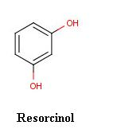
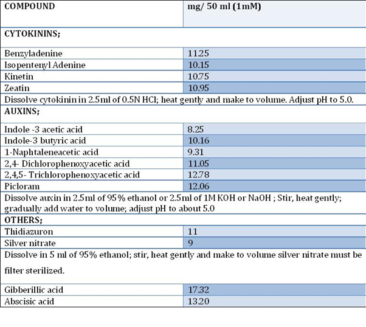

### Materials Required

•    Sterile Glass Petri dish

•    Sterile forceps

•    Sterile scalpel

•    Beaker

•    Test tube rack

•    Waterproof marking pen

•    culture tubes

•    Sterile blue cap tubes

•    Bunsen burner

•    Laminar air flow

•    Jar with lid

•    Analytical balance 

&nbsp;

### Reagents

•    Chlorate bleach solution (1.4% of chlorine and wetting agent   available)

•    Carrot Callus Initiation Medium -500 ml

•    Carrot shoots initiation Medium - 500 ml

•    Carrot root initiation Medium - 500 ml

•    70% Ethanol

•    sterile distilled water   -250 ml

•    Healthy, undamaged Carrot   ( Daucus carota)- ½

### Reagent preparation:

#### 1. Stock Prepration

Composition of MS(Murashige and Skoog 1962), B5(Gamborg et.al.1968) and SH (Schenk and Hilderbrandt, 1972) basal media.
 

&nbsp;

#### 2. Stock solution of growth regulators

 

&nbsp;

#### 3. Preparation of basic B5 medium, 1L

Major salts stocks         -100 ml

Minor salts stock           -10 ml

Iron EDTA stock            -5ml

Vitamin stock               -10ml

Sucrose                       -20g

Distilled water              - 400 ml

Growth regulators from the stock solution-. 50 ml

The callus initiation medium Contains the macro and micronutrients, vitamins, agar and plant growth regulators, contain auxins  and cytokinin  (especially 2,4 Dichlorophenoxyacetic acid  - 1mg/l ( 11.05mM)  required to initiate carrot callus from the tissue,  pH = 3.5  -4.5).

&nbsp;

#### 4.    Callus shoot initiation basal medium (mg/L), pH = 3.5 - 4.5.

It contains the macro and micronutrients, vitamins, agar  and plant growth regulators (cytokinin) required to initiate shoot from carrot callus.

&nbsp;

#### 5. Callus root  initiation basal medium (mg/L), pH = 3.5  - 4.5.

It contains the macro and micronutrients, vitamins, and plant growth regulators  (Auxins) required to initiate root from carrot callus.

&nbsp;

### Procedure

1. Wipe down and turn on the laminar air flow 15 minute before doing work in the hood. Flames –sterilize the instruments.

2. Cut the carrot root into 3-6 cm long, discarding both ends of   the root. Remove the epidermis and any blemishes with scalpel.

3. Put the tap root section in to a sterile jar having chlorate bleach solution (approximately 1.4% available chlorine) and shake it for few seconds.

4. Remove the bleach solution into the waste beaker.

5. Cut 1cm of the carrot root section from each end and discard this end portions.

6. Cut 3-5 transverse section (1-5mm thick) across the tap root and transfer each to a fresh sterile Petri dish.

7. Cut the smaller sections, explants (approximately 5mm square) from each of the transverse sections by cutting across the cambium. The following method is recommended.
              
a. Trim the cortex and some of the phloem from each transverse section

b. Cut off 5mm – wide strips containing the cambium

c. Each strip can then be subdivided to produce 5mm square explants, each containing parts of the phloem, xylem and cambium.

8. Measure the weight of the explants.

9. Put each explants sections into culture tubes containing the carrot   callus initiation medium (one explants per tube).

10. Seal all the tubes with parafilm   to reduce dehydration of the medium.

11. Incubate the culture tubes in the dark at 25°C. Examine at weekly intervals and record the changes observed.

12. Callus formed is removed from the primary explants after 45 days and it is weighed.

13. The calli is subculture into the same medium for further callus  growth or to the carrot   shoot / root initiation medium.

14. Seal all the tubes having calli with parafilm to reduce dehydration of the medium.

15. Incubate all the tubes in the dark at 25 °C.

16. Measuring the efficacy of roots and shoots.
 
&nbsp;

### Difference Encountered in a Real Laboratory

In an actual laboratory setting, there are certain important steps that are not necessarily applicable   in a virtual lab:

1. Properly adjust the flame of the Bunsen burner. The proper flame is a small blue cone; it is not a large plume, nor is it orange.

&nbsp;

2. Always label the tubes and plates with:
                  
    a. The type of media 

    b. Your initials

    c. The date and time

&nbsp;

3. Seal the tissue culture container to keep it sterile.

&nbsp;

4. Always disinfect your work area when you are finished.

 
